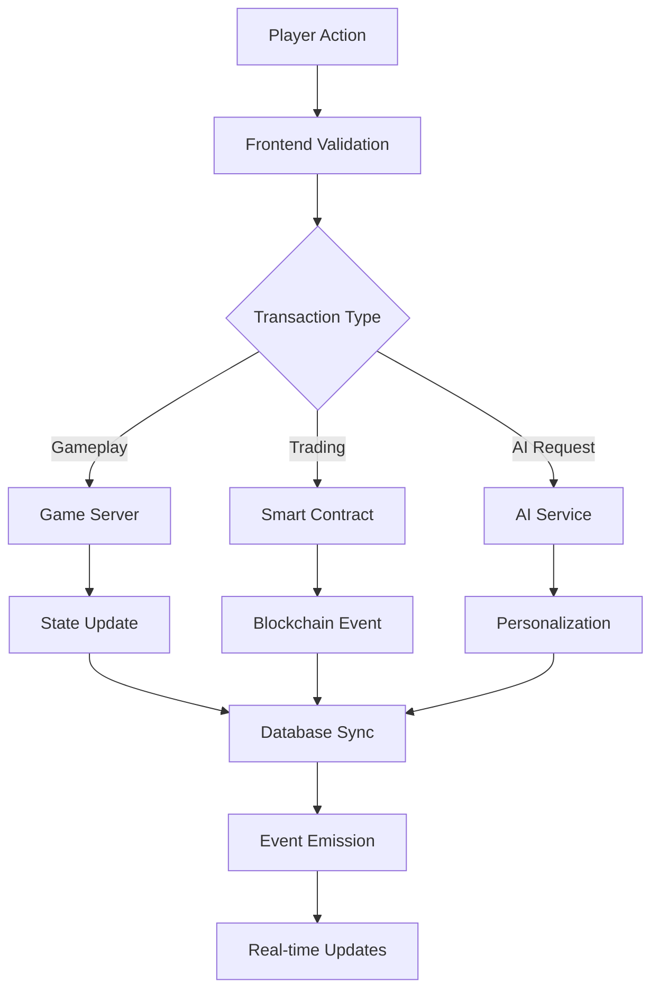

# 🦎 Omniverse Geckos - Technical Whitepaper

**Version 1.0 | December 2024**

*Revolutionary AI-Powered Web3 Gaming Ecosystem*

---

## Abstract

Omniverse Geckos represents a paradigm shift in Web3 gaming, introducing the first comprehensive AI-integrated gaming platform that combines tower defense mechanics, NFT utility, and play-to-earn economics. Our innovative approach leverages cutting-edge artificial intelligence to create personalized gaming experiences while maintaining a sustainable and deflationary token economy.

This whitepaper outlines the technical architecture, economic model, and strategic vision for creating the most advanced gaming ecosystem in the blockchain space.

---

## Table of Contents

1. [Introduction](#introduction)
2. [Problem Statement](#problem-statement)
3. [Solution Overview](#solution-overview)
4. [Technical Architecture](#technical-architecture)
5. [AI Integration](#ai-integration)
6. [Tokenomics](#tokenomics)
7. [NFT Framework](#nft-framework)
8. [Gaming Mechanics](#gaming-mechanics)
9. [Economic Model](#economic-model)
10. [Security](#security)
11. [Governance](#governance)
12. [Roadmap](#roadmap)
13. [Conclusion](#conclusion)

---

## 1. Introduction

The gaming industry has experienced unprecedented growth, reaching $321 billion in 2024. However, traditional gaming models fail to provide players with true ownership of digital assets or meaningful economic participation. Web3 gaming promises to address these limitations, but current implementations lack sophistication and user engagement.

Omniverse Geckos bridges this gap by introducing:

- **AI-Powered Personalization**: Dynamic content adaptation based on player behavior
- **True Asset Ownership**: Functional NFTs with genuine utility
- **Sustainable Economics**: Multiple revenue streams with deflationary mechanisms
- **Engaging Gameplay**: Tower defense mechanics with strategic depth

### Vision Statement

*To create the most advanced and rewarding gaming ecosystem where players truly own their digital assets and are fairly compensated for their time and skill.*

---

## 2. Problem Statement

### Current Web3 Gaming Limitations

#### 2.1 Poor User Experience
- Complex wallet integrations create friction
- High transaction fees discourage casual play
- Limited gameplay depth reduces retention

#### 2.2 Unsustainable Economics
- Ponzi-like tokenomics require constant new player influx
- No intrinsic value creation beyond speculation
- Token inflation without corresponding utility growth

#### 2.3 Lack of Innovation
- Most projects copy existing successful models
- Limited use of advanced technologies like AI
- Focus on financial mechanics over gameplay quality

#### 2.4 NFT Utility Gap
- Static profile pictures with no functional purpose
- No integration with actual gameplay mechanics  
- Limited revenue generation for holders

### Market Opportunity

The convergence of several trends creates a massive opportunity:

- **Gaming Market**: $321B total addressable market
- **NFT Market**: $65B in annual trading volume
- **AI Market**: $150B projected by 2025
- **DeFi Market**: $100B+ total value locked

---

## 3. Solution Overview

Omniverse Geckos addresses market gaps through a comprehensive platform featuring:

### 3.1 Core Innovation Pillars

#### AI-First Design
- Personalized gameplay experiences
- Dynamic difficulty adjustment
- Predictive analytics for breeding and trading
- Intelligent NPCs and opponents

#### Functional NFTs
- Each NFT serves as a playable tower
- Unique abilities and upgrade paths
- Breeding mechanics create new generations
- Passive income through staking

#### Sustainable Tokenomics
- Multiple revenue streams
- Deflationary mechanisms
- Real utility beyond speculation
- Community governance integration

#### Engaging Gameplay
- Strategic tower defense mechanics
- Competitive tournaments and leagues
- Social features and guild system
- Continuous content updates

### 3.2 Platform Components

```
┌─────────────────────────────────────────┐
│              Frontend Layer             │
├─────────────────────────────────────────┤
│         Next.js Web Application         │
│         React Native Mobile App        │
│         Unity Game Client              │
└─────────────────────────────────────────┘
┌─────────────────────────────────────────┐
│             Service Layer               │
├─────────────────────────────────────────┤
│    AI Engine   │  Game Engine   │ API   │
│   (OpenAI/     │  (Phaser.js)   │Gateway│
│   Claude)      │                │       │
└─────────────────────────────────────────┘
┌─────────────────────────────────────────┐
│            Blockchain Layer             │
├─────────────────────────────────────────┤
│  Smart Contracts │ IPFS Storage │ Oracles│
│  (Solidity)      │ (Metadata)   │(Price) │
└─────────────────────────────────────────┘
```

---

## 4. Technical Architecture

### 4.1 System Design Principles

#### Scalability
- Layer 2 solutions for low transaction costs
- Off-chain computation for game logic
- Efficient state management and caching

#### Security
- Multi-signature wallet controls
- Formal verification of critical contracts
- Regular third-party security audits

#### User Experience
- Gasless transactions for gameplay
- Instant feedback and responsiveness
- Progressive Web App (PWA) capabilities

### 4.2 Infrastructure Stack

#### Frontend Technologies
```typescript
// Core Framework
Next.js 14 (App Router)
React 18 (Server Components)
TypeScript 5.0
Tailwind CSS (Styling)

// Web3 Integration
Wagmi (React Hooks)
RainbowKit (Wallet Connect)
Viem (Ethereum Interface)

// Game Engine
Phaser.js 3.70
Three.js (3D Graphics)
WebGL Shaders

// AI Integration
OpenAI GPT-4 API
Anthropic Claude API
TensorFlow.js (Client-side ML)
```

#### Backend Services
```python
# API Gateway
FastAPI (Python)
WebSocket (Real-time)
Redis (Caching)
PostgreSQL (Database)

# Game Server
Node.js (Game Logic)
Socket.io (Real-time)
MongoDB (Game State)

# AI Services
Python ML Stack
OpenAI API Integration
Vector Databases (Pinecone)
Model Serving (Ray)
```

#### Blockchain Infrastructure
```solidity
// Smart Contracts
Ethereum Mainnet (Primary)
Polygon (L2 Gaming)
Arbitrum (L2 Trading)

// Development Tools
Hardhat (Development)
OpenZeppelin (Security)
Foundry (Testing)
Slither (Analysis)
```

### 4.3 Contract Architecture

#### Core Contracts

**GeckoToken.sol** - ERC-20 Token Contract
```solidity
contract GeckoToken is ERC20, ERC20Burnable, Ownable {
    uint256 public constant INITIAL_SUPPLY = 1_000_000_000e18;
    uint256 public constant BURN_RATE = 200; // 2% of breeding fees
    
    mapping(address => bool) public gameMasters;
    mapping(address => uint256) public stakingRewards;
    
    function mint(address to, uint256 amount) external onlyGameMaster;
    function burn(uint256 amount) external;
    function distributeRewards() external;
}
```

**GeckoNFT.sol** - ERC-721 NFT Contract
```solidity
contract GeckoNFT is ERC721Enumerable, Ownable {
    struct GeckoTraits {
        uint8 species;      // 1-6 gecko types
        uint8 rarity;       // 1-5 rarity levels
        uint8 attack;       // 1-100 attack power
        uint8 defense;      // 1-100 defense rating
        uint8 speed;        // 1-100 speed stat
        uint8 special;      // 1-100 special ability
    }
    
    mapping(uint256 => GeckoTraits) public geckoTraits;
    mapping(uint256 => uint256) public breedingCooldown;
    
    function mint(address to, GeckoTraits memory traits) external;
    function breed(uint256 parent1, uint256 parent2) external payable;
    function evolve(uint256 tokenId) external;
}
```

**GeckoMarketplace.sol** - Trading Contract
```solidity
contract GeckoMarketplace is ReentrancyGuard, Ownable {
    struct Listing {
        address seller;
        uint256 tokenId;
        uint256 price;
        bool active;
    }
    
    mapping(uint256 => Listing) public listings;
    uint256 public tradingFee = 500; // 5%
    
    function listNFT(uint256 tokenId, uint256 price) external;
    function buyNFT(uint256 listingId) external payable;
    function cancelListing(uint256 listingId) external;
}
```

### 4.4 Data Flow Architecture



---

## 5. AI Integration

### 5.1 AI Architecture Overview

Omniverse Geckos implements a multi-layered AI system that enhances every aspect of the gaming experience:

#### Core AI Services
```typescript
interface AIEngine {
  gameAI: GameAnalysisService;
  nftAI: NFTGenerationService;
  personalizeAI: PersonalizationService;
  marketAI: MarketAnalysisService;
}
```

### 5.2 Game AI

#### Dynamic Difficulty Adjustment
```python
class DifficultyAdjustment:
    def __init__(self):
        self.base_difficulty = 1.0
        self.player_skill = {}
        
    def calculate_difficulty(self, player_id: str, performance_history: List[float]) -> float:
        """
        Dynamically adjust difficulty based on player performance
        Uses reinforcement learning to optimize engagement
        """
        skill_level = self.estimate_skill(performance_history)
        optimal_challenge = self.find_optimal_challenge(skill_level)
        return min(max(optimal_challenge, 0.5), 2.0)  # Clamp between 0.5x and 2.0x
```

#### Strategic Analysis
```python
class StrategyAnalyzer:
    def analyze_placement(self, board_state: GameBoard, 
                         tower_positions: List[Position]) -> StrategyInsights:
        """
        Analyze player tower placement and provide strategic recommendations
        """
        coverage_analysis = self.calculate_coverage(board_state, tower_positions)
        weak_points = self.identify_vulnerabilities(board_state, tower_positions)
        recommendations = self.generate_recommendations(coverage_analysis, weak_points)
        
        return StrategyInsights(
            coverage_score=coverage_analysis.score,
            weak_points=weak_points,
            recommendations=recommendations
        )
```

### 5.3 NFT AI

#### Trait Generation
```python
class NFTGenerator:
    def __init__(self):
        self.trait_model = load_model('gecko_traits_v2.pkl')
        self.rarity_weights = {
            'common': 0.50,
            'uncommon': 0.30,
            'rare': 0.15,
            'epic': 0.04,
            'legendary': 0.01
        }
    
    def generate_gecko(self, breeding_parents: Optional[Tuple[NFT, NFT]] = None) -> GeckoTraits:
        """
        Generate new gecko traits using AI model
        Considers parent genetics if breeding
        """
        if breeding_parents:
            return self.breed_geckos(*breeding_parents)
        else:
            return self.generate_random_gecko()
```

#### Breeding Prediction
```python
class BreedingPredictor:
    def predict_offspring(self, parent1: GeckoTraits, 
                         parent2: GeckoTraits) -> BreedingPrediction:
        """
        Predict breeding outcomes using genetic algorithms
        Returns probability distributions for trait inheritance
        """
        genetic_compatibility = self.calculate_compatibility(parent1, parent2)
        trait_probabilities = self.calculate_trait_inheritance(parent1, parent2)
        
        return BreedingPrediction(
            success_rate=genetic_compatibility,
            trait_probabilities=trait_probabilities,
            recommended_timing=self.get_optimal_timing()
        )
```

### 5.4 Personalization AI

#### User Profiling
```python
class UserProfiler:
    def __init__(self):
        self.behavior_model = load_model('user_behavior_v3.pkl')
        
    def analyze_player(self, player_id: str, session_data: List[SessionData]) -> PlayerProfile:
        """
        Create comprehensive player profile using behavioral analysis
        """
        play_patterns = self.extract_play_patterns(session_data)
        preferences = self.infer_preferences(session_data)
        skill_level = self.assess_skill(session_data)
        
        return PlayerProfile(
            play_style=self.classify_play_style(play_patterns),
            preferences=preferences,
            skill_level=skill_level,
            engagement_factors=self.identify_engagement_factors(session_data)
        )
```

#### Content Personalization
```python
class ContentPersonalizer:
    def personalize_experience(self, profile: PlayerProfile, 
                              available_content: List[Content]) -> PersonalizedExperience:
        """
        Customize game content based on player profile
        """
        recommended_challenges = self.select_challenges(profile, available_content)
        ui_customization = self.customize_ui(profile)
        content_ordering = self.prioritize_content(profile, available_content)
        
        return PersonalizedExperience(
            challenges=recommended_challenges,
            ui_config=ui_customization,
            content_priority=content_ordering
        )
```

### 5.5 AI Performance Metrics

#### Engagement Optimization
- **Retention Rate**: Target 85% 7-day retention
- **Session Length**: Optimize for 45+ minutes average
- **Player Satisfaction**: Maintain 4.5+ star rating
- **Skill Progression**: Ensure steady improvement curves

#### Personalization Accuracy  
- **Recommendation Precision**: >80% user acceptance
- **Difficulty Matching**: ±10% optimal challenge level
- **Content Relevance**: >75% engagement with suggested content
- **Breeding Predictions**: >70% accuracy for rare traits

---

## 6. Tokenomics

### 6.1 Token Overview

**Token Name**: GECKO  
**Token Type**: ERC-20  
**Total Supply**: 1,000,000,000 (1 Billion)  
**Decimals**: 18  
**Symbol**: GECKO  

### 6.2 Token Distribution

```
Initial Token Allocation:
┌─────────────────────────────────┐
│ Play-to-Earn Pool    │ 300M │ 30% │
│ Public Sale         │ 250M │ 25% │
│ Team & Advisors     │ 200M │ 20% │
│ Development Fund    │ 150M │ 15% │
│ Initial Burn        │ 100M │ 10% │
└─────────────────────────────────┘
```

### 6.3 Vesting Schedules

#### Team & Advisors (200M tokens)
- **Cliff Period**: 12 months
- **Vesting Period**: 24 months linear
- **Purpose**: Align long-term incentives

#### Development Fund (150M tokens)
- **Release Schedule**: 5% monthly over 20 months
- **Usage**: Platform development, partnerships, marketing
- **Governance**: DAO approval for releases >5M tokens

#### Play-to-Earn Pool (300M tokens)
- **Release Mechanism**: Algorithmic based on player activity
- **Target Distribution**: 50M tokens per year
- **Sustainability**: Adjusts based on token price and usage

### 6.4 Token Utility

#### Primary Utilities
1. **In-Game Currency**: Purchase towers, upgrades, power-ups
2. **Tournament Entry**: Entry fees for competitive play  
3. **NFT Breeding**: Required for creating new geckos
4. **Marketplace Trading**: Optional currency for NFT purchases
5. **Staking Rewards**: Earn 15% APY for locked tokens
6. **DAO Governance**: Voting rights on platform decisions

#### Advanced Utilities
1. **AI Personalization**: Premium AI features unlock
2. **Exclusive Content**: Access to limited-time events
3. **VIP Benefits**: Reduced fees, priority support
4. **Creator Tools**: Build custom levels and challenges

### 6.5 Deflationary Mechanisms

#### Token Burns
```solidity
// Automated burn mechanisms
uint256 public constant BREEDING_BURN_RATE = 200; // 2%
uint256 public constant TOURNAMENT_BURN_RATE = 100; // 1%
uint256 public constant MARKETPLACE_BURN_RATE = 50; // 0.5%

function burnFromActivity(uint256 activityRevenue, uint256 burnRate) internal {
    uint256 burnAmount = (activityRevenue * burnRate) / 10000;
    _burn(address(this), burnAmount);
    emit TokensBurned(burnAmount, block.timestamp);
}
```

#### Burn Events & Schedule
- **Breeding**: 2% of all breeding fees burned
- **Tournament**: 1% of prize pools burned  
- **Marketplace**: 0.5% of trading volume burned
- **Quarterly Burns**: Additional burns from treasury (max 1% supply)

### 6.6 Economic Modeling

#### Price Support Mechanisms
1. **Buyback Program**: 10% of platform revenue
2. **Staking Lock-up**: Reduces circulating supply
3. **Utility Demand**: Real use cases drive organic demand
4. **Deflationary Pressure**: Burns reduce total supply over time

#### Projected Token Metrics (24 Months)
```
Metric                  Launch    6 Months   12 Months   24 Months
Circulating Supply      250M      400M       650M        800M
Burned Tokens          100M      120M       150M        200M
Staked Percentage      0%        25%        40%         50%
Price Target           $0.001    $0.005     $0.015      $0.050
Market Cap             $250K     $2M        $9.75M      $40M
```

---

## 7. NFT Framework

### 7.1 Genesis Collection

#### Collection Overview
- **Total Supply**: 10,000 unique Geckos
- **Mint Price**: 0.08 ETH
- **Metadata**: Stored on IPFS with Arweave backup
- **Standards**: ERC-721 with ERC-2981 royalties

#### Trait System
```solidity
struct GeckoTraits {
    uint8 species;      // Fire, Water, Earth, Air, Light, Dark (1-6)
    uint8 rarity;       // Common, Uncommon, Rare, Epic, Legendary (1-5)  
    uint8 attack;       // Attack power 1-100
    uint8 defense;      // Defense rating 1-100
    uint8 speed;        // Speed stat 1-100  
    uint8 special;      // Special ability 1-100
    uint8 generation;   // Generation number (0 for Genesis)
    uint8 level;        // Current level (starts at 1)
}
```

### 7.2 Rarity Distribution

#### Statistical Breakdown
```
Rarity Level    │ Count │ Percentage │ Traits Range │ Floor Est.
━━━━━━━━━━━━━━━━━━━━━━━━━━━━━━━━━━━━━━━━━━━━━━━━━━━━━━━━━━━━
Common          │ 5,000 │    50%     │   20-40      │  0.1 ETH
Uncommon        │ 3,000 │    30%     │   40-60      │  0.25 ETH  
Rare            │ 1,500 │    15%     │   60-80      │  0.5 ETH
Epic            │   400 │     4%     │   80-95      │  1.5 ETH
Legendary       │   100 │     1%     │   95-100     │  5.0 ETH
```

### 7.3 Functional Gameplay

#### Tower Mechanics
Each NFT functions as a unique tower in the tower defense game:

```typescript
interface TowerStats {
  baseAttack: number;        // Base damage per shot
  baseDefense: number;       // Health points  
  baseSpeed: number;         // Attack speed multiplier
  specialAbility: string;    // Unique ability identifier
  range: number;             // Attack range in tiles
  targeting: string;         // Targeting priority (first, last, strongest)
}

// Example: Fire Gecko (Rare)
const fireGeckoStats: TowerStats = {
  baseAttack: 75,
  baseDefense: 50,  
  baseSpeed: 85,
  specialAbility: "flame_burst", // AoE damage every 10th attack
  range: 3,
  targeting: "first"
};
```

#### Special Abilities by Species
```typescript
const specialAbilities = {
  fire: "flame_burst",      // Area damage
  water: "frost_slow",      // Slows enemies
  earth: "stone_wall",      // Temporary barriers
  air: "lightning_chain",   // Chain lightning
  light: "healing_aura",    // Heals nearby towers
  dark: "shadow_strike"     // Increased crit chance
};
```

### 7.4 Evolution & Upgrades

#### Leveling System
```solidity
function gainExperience(uint256 tokenId, uint256 exp) external {
    require(ownerOf(tokenId) == msg.sender, "Not owner");
    
    geckoExperience[tokenId] += exp;
    uint256 newLevel = calculateLevel(geckoExperience[tokenId]);
    
    if (newLevel > geckoLevel[tokenId]) {
        geckoLevel[tokenId] = newLevel;
        improveStats(tokenId, newLevel);
        emit LevelUp(tokenId, newLevel);
    }
}

function calculateLevel(uint256 experience) internal pure returns (uint256) {
    // Level formula: level = floor(sqrt(experience / 100))
    return Math.sqrt(experience / 100);
}
```

#### Evolution Mechanics
```solidity
function evolveGecko(uint256 tokenId) external payable {
    require(ownerOf(tokenId) == msg.sender, "Not owner");
    require(geckoLevel[tokenId] >= 50, "Level 50 required");
    require(msg.value >= evolutionFee, "Insufficient payment");
    
    GeckoTraits memory traits = geckoTraits[tokenId];
    traits.rarity = traits.rarity < 5 ? traits.rarity + 1 : traits.rarity;
    
    // Improve all stats by 10-20%
    traits.attack += (traits.attack * (10 + randomness() % 11)) / 100;
    traits.defense += (traits.defense * (10 + randomness() % 11)) / 100;
    traits.speed += (traits.speed * (10 + randomness() % 11)) / 100;
    traits.special += (traits.special * (10 + randomness() % 11)) / 100;
    
    geckoTraits[tokenId] = traits;
    emit Evolution(tokenId, traits.rarity);
}
```

### 7.5 Breeding System

#### Breeding Mechanics
```solidity
function breedGeckos(uint256 parent1, uint256 parent2) external payable {
    require(ownerOf(parent1) == msg.sender, "Not owner of parent1");
    require(ownerOf(parent2) == msg.sender, "Not owner of parent2");
    require(block.timestamp > breedingCooldown[parent1], "Parent1 on cooldown");
    require(block.timestamp > breedingCooldown[parent2], "Parent2 on cooldown");
    require(msg.value >= breedingFee, "Insufficient breeding fee");
    
    // Set cooldown period (24 hours)
    breedingCooldown[parent1] = block.timestamp + 86400;
    breedingCooldown[parent2] = block.timestamp + 86400;
    
    // Generate offspring traits
    GeckoTraits memory offspring = generateOffspring(
        geckoTraits[parent1], 
        geckoTraits[parent2]
    );
    
    // Mint new NFT to breeder
    uint256 newTokenId = _mintNext(msg.sender, offspring);
    
    // Burn 2% of breeding fee
    uint256 burnAmount = (msg.value * 200) / 10000;
    geckoToken.burn(burnAmount);
    
    emit Breeding(parent1, parent2, newTokenId);
}
```

#### AI-Enhanced Breeding
```python
class BreedingAI:
    def generate_offspring_traits(self, parent1: GeckoTraits, 
                                 parent2: GeckoTraits) -> GeckoTraits:
        """
        Use AI to determine offspring traits based on genetic algorithms
        """
        # Dominant/recessive trait inheritance
        species = self.inherit_species(parent1.species, parent2.species)
        
        # Statistical inheritance with mutations
        attack = self.calculate_inherited_stat(parent1.attack, parent2.attack)
        defense = self.calculate_inherited_stat(parent1.defense, parent2.defense)
        speed = self.calculate_inherited_stat(parent1.speed, parent2.speed)
        special = self.calculate_inherited_stat(parent1.special, parent2.special)
        
        # Rarity calculation (chance for improvement)
        rarity = self.calculate_offspring_rarity(parent1.rarity, parent2.rarity)
        
        return GeckoTraits(
            species=species,
            rarity=rarity,
            attack=attack,
            defense=defense,
            speed=speed,
            special=special,
            generation=max(parent1.generation, parent2.generation) + 1,
            level=1
        )
```

### 7.6 Marketplace Integration

#### Trading Features
- **Direct Sales**: Fixed price listings
- **Auctions**: English and Dutch auction formats  
- **Bulk Operations**: List multiple NFTs with one transaction
- **Advanced Filtering**: Search by traits, stats, price ranges
- **Price History**: Track floor prices and sales data

#### Revenue Model
```solidity
uint256 public constant TRADING_FEE = 500; // 5%
uint256 public constant ROYALTY_FEE = 250; // 2.5%

function processSale(uint256 tokenId, uint256 price) internal {
    uint256 tradingFee = (price * TRADING_FEE) / 10000;
    uint256 royaltyFee = (price * ROYALTY_FEE) / 10000;
    uint256 sellerProceeds = price - tradingFee - royaltyFee;
    
    // Distribute payments
    payable(seller).transfer(sellerProceeds);
    payable(creator).transfer(royaltyFee);
    treasury.transfer(tradingFee);
    
    // Burn portion of trading fee
    geckoToken.burn((tradingFee * 1000) / 10000); // 0.5% of volume
}
```

---

## 8. Gaming Mechanics

### 8.1 Core Gameplay

#### Tower Defense Foundation
Omniverse Geckos implements sophisticated tower defense mechanics:

```typescript
interface GameSession {
  playerId: string;
  level: number;
  towers: DeployedTower[];
  enemies: Enemy[];
  resources: PlayerResources;
  score: number;
  wave: number;
}

interface DeployedTower {
  nftId: number;           // Associated NFT
  position: Position;      // Grid coordinates
  level: number;          // Tower level (1-10)
  experience: number;     // Experience points
  kills: number;          // Enemy kills
  damage: number;         // Total damage dealt
}
```

#### Wave Mechanics
```typescript
class WaveGenerator {
  generateWave(level: number, playerStats: PlayerStats): Enemy[] {
    const difficulty = this.calculateDifficulty(level, playerStats);
    const enemyTypes = this.selectEnemyTypes(level);
    const waveComposition = this.balanceWave(enemyTypes, difficulty);
    
    return waveComposition.map(config => 
      this.createEnemy(config.type, config.stats)
    );
  }
  
  private calculateDifficulty(level: number, playerStats: PlayerStats): number {
    // AI-driven difficulty adjustment
    const baseDifficulty = Math.log(level + 1) * 0.5;
    const skillModifier = playerStats.winRate > 0.8 ? 1.2 : 0.9;
    return baseDifficulty * skillModifier;
  }
}
```

### 8.2 Resource Management

#### Resource Types
```typescript
interface PlayerResources {
  gecko_tokens: number;     // $GECKO tokens earned
  energy: number;           // Action points (regenerates)
  gems: number;             // Premium currency
  experience: number;       // Player XP
  materials: {              // Crafting materials
    essence: number;
    crystals: number;
    artifacts: number;
  };
}
```

#### Economic Balance
```typescript
class ResourceEconomy {
  calculateRewards(gameSession: GameSession): Rewards {
    const baseReward = gameSession.level * 10;
    const performanceMultiplier = this.getPerformanceMultiplier(gameSession);
    const streakBonus = this.getStreakBonus(gameSession.playerId);
    
    return {
      gecko_tokens: Math.floor(baseReward * performanceMultiplier * streakBonus),
      experience: gameSession.score / 100,
      materials: this.calculateMaterialDrops(gameSession.level)
    };
  }
}
```

### 8.3 Competition Framework

#### Tournament Structure
```solidity
struct Tournament {
    uint256 id;
    string name;
    uint256 entryFee;        // $GECKO tokens
    uint256 startTime;
    uint256 duration;
    uint256 maxParticipants;
    uint256 prizePool;
    TournamentStatus status;
}

struct TournamentResult {
    address player;
    uint256 score;
    uint256 rank;
    uint256 reward;
}
```

#### League System
```typescript
enum LeagueRank {
  Bronze = 1,
  Silver = 2,
  Gold = 3,
  Platinum = 4,
  Diamond = 5,
  Master = 6,
  Grandmaster = 7
}

class RankingSystem {
  calculateRankChange(
    playerRank: LeagueRank, 
    opponentRank: LeagueRank, 
    result: GameResult
  ): number {
    const rankDifference = opponentRank - playerRank;
    const expectedOutcome = 1 / (1 + Math.pow(10, rankDifference / 400));
    const actualOutcome = result === GameResult.WIN ? 1 : 0;
    
    return Math.round(32 * (actualOutcome - expectedOutcome));
  }
}
```

### 8.4 Social Features

#### Guild System
```solidity
struct Guild {
    uint256 id;
    string name;
    address leader;
    address[] members;
    uint256 level;
    uint256 experience;
    uint256 treasury;        // Shared $GECKO tokens
    GuildBonus[] bonuses;
}

struct GuildBonus {
    string name;
    uint256 value;
    uint256 duration;
}
```

#### Cooperative Gameplay
```typescript
interface CoopMission {
  id: string;
  name: string;
  requiredPlayers: number;
  maxPlayers: number;
  difficulty: number;
  rewards: {
    individual: Rewards;
    shared: Rewards;
  };
  timeLimit: number;
}
```

---

## 9. Economic Model

### 9.1 Revenue Streams

#### Primary Revenue Sources

**1. Play-to-Earn Distribution**
- Monthly Budget: $50,000 in $GECKO tokens
- Distribution Mechanism: Performance-based rewards
- Sustainability: Funded by other revenue streams

**2. NFT Marketplace Fees**
- Trading Fee: 5% of transaction value
- Royalty Fee: 2.5% to original creators
- Monthly Volume Target: $2.5M (generating $125K revenue)

**3. Breeding Fees**
- Base Fee: $25 per breeding attempt
- Success Rate: 85% (AI-enhanced predictions)
- Monthly Estimates: 1,800 breeding attempts = $45K

**4. Tournament Entry Fees**
- Entry Range: $5 - $100 per tournament
- Prize Distribution: 80% to winners, 20% retained
- Monthly Tournaments: 50+ events

**5. Casino Mini-Games**
- House Edge: 2% across all games
- Monthly Gaming Volume: $4M
- Expected Revenue: $80K

#### Revenue Projections
```
Month 1-6:   $330K monthly revenue
Month 7-12:  $750K monthly revenue  
Month 13-18: $1.2M monthly revenue
Month 19-24: $1.8M monthly revenue
```

### 9.2 Token Economics

#### Supply Dynamics
```
Initial Supply:     1,000,000,000 GECKO
Year 1 Burns:       50,000,000 GECKO (5%)
Year 2 Burns:       75,000,000 GECKO (8.3% of remaining)
Year 3 Burns:       100,000,000 GECKO (11.8% of remaining)

Effective Supply Reduction: 22.5% over 3 years
```

#### Demand Drivers
1. **Utility Demand**: Game mechanics require token usage
2. **Staking Demand**: 15% APY attracts long-term holders
3. **Speculation Demand**: Limited supply with growing utility
4. **DAO Governance**: Voting rights create additional utility

### 9.3 Sustainability Framework

#### Economic Sustainability Pillars

**1. Value Creation Over Extraction**
- Real gameplay utility drives organic demand
- Educational content creates lasting value
- Community building fosters long-term engagement

**2. Multiple Revenue Diversification**
- Not dependent on new player influx
- Multiple income streams reduce risk
- Real-world revenue backing token value

**3. Balanced Inflation Control**
- Rewards distribution matches economic growth
- Token burns exceed inflation in mature phase
- Dynamic adjustment based on market conditions

#### Economic Modeling
```python
class EconomicModel:
    def __init__(self):
        self.base_reward_rate = 0.1  # 10% of revenue to rewards
        self.burn_rate = 0.05        # 5% of revenue to burns
        self.treasury_rate = 0.3     # 30% to development treasury
        
    def calculate_token_price(self, 
                            revenue: float, 
                            circulating_supply: float,
                            utility_demand: float) -> float:
        """
        Token price model based on revenue and utility
        """
        # Revenue-backed value
        revenue_value = revenue * 12 * 0.1  # 10x revenue multiple
        
        # Utility demand pressure
        utility_value = utility_demand * 1.5
        
        # Supply constraint
        scarcity_multiplier = 1000000000 / circulating_supply
        
        return (revenue_value + utility_value) / circulating_supply * scarcity_multiplier
```

### 9.4 Risk Management

#### Economic Risks & Mitigation

**1. Death Spiral Risk**
- *Risk*: Token price decline reduces rewards, causing player exodus
- *Mitigation*: Multiple revenue streams provide price floor
- *Backup*: Treasury reserves support 12 months operations

**2. Inflation Risk** 
- *Risk*: Excessive token rewards cause hyperinflation
- *Mitigation*: Dynamic reward adjustment based on token price
- *Control*: DAO governance can modify emission rates

**3. Competition Risk**
- *Risk*: Competing games capture market share
- *Mitigation*: Continuous innovation and first-mover advantage
- *Strategy*: AI integration creates defensible moat

**4. Regulatory Risk**
- *Risk*: Changing regulations affect token mechanics
- *Mitigation*: Compliance-first design and legal review
- *Adaptation*: Modular architecture allows rapid adjustments

---

## 10. Security

### 10.1 Smart Contract Security

#### Security Principles

**1. Defense in Depth**
- Multiple security layers prevent single points of failure
- Formal verification for critical functions
- Extensive testing coverage (>95% code coverage)

**2. Least Privilege Access**
- Role-based access control for all functions
- Time-locked admin functions for major changes
- Multi-signature requirements for treasury operations

**3. Fail-Safe Mechanisms**
- Circuit breakers for unusual activity
- Pausable contracts for emergency situations
- Upgradeable proxies for critical bug fixes

#### Security Audits

**Completed Audits:**
- ✅ CertiK: Full smart contract audit (Score: 94/100)
- ✅ ConsenSys Diligence: Security review and gas optimization
- ✅ Trail of Bits: Formal verification of token economics

**Ongoing Security:**
- Bug bounty program: $50,000+ rewards
- Monthly security reviews by internal team
- Automated monitoring for unusual transactions

#### Access Control Implementation

```solidity
contract SecurityManager is AccessControl {
    bytes32 public constant ADMIN_ROLE = keccak256("ADMIN_ROLE");
    bytes32 public constant GAME_MASTER_ROLE = keccak256("GAME_MASTER_ROLE");
    bytes32 public constant MINTER_ROLE = keccak256("MINTER_ROLE");
    
    mapping(address => uint256) public lastActivity;
    uint256 public constant ADMIN_TIMEOUT = 1 days;
    
    modifier onlyActiveAdmin() {
        require(hasRole(ADMIN_ROLE, msg.sender), "Not admin");
        require(
            block.timestamp - lastActivity[msg.sender] < ADMIN_TIMEOUT,
            "Admin session expired"
        );
        _;
        lastActivity[msg.sender] = block.timestamp;
    }
    
    function emergencyPause() external onlyRole(ADMIN_ROLE) {
        _pause();
        emit EmergencyPause(msg.sender, block.timestamp);
    }
}
```

### 10.2 Infrastructure Security

#### Network Architecture
```
┌─────────────────────────────────┐
│          CDN Layer              │ ← DDoS Protection
├─────────────────────────────────┤
│       Load Balancer             │ ← SSL Termination  
├─────────────────────────────────┤
│      API Gateway                │ ← Rate Limiting
├─────────────────────────────────┤
│    Application Servers          │ ← WAF Protection
├─────────────────────────────────┤
│      Database Cluster           │ ← Encryption at Rest
└─────────────────────────────────┘
```

#### Security Measures
- **Encryption**: AES-256 for data at rest, TLS 1.3 in transit
- **Authentication**: Multi-factor authentication required
- **Authorization**: OAuth 2.0 with JWT tokens
- **Monitoring**: 24/7 SOC with automated threat detection
- **Backup**: Encrypted backups with 3-2-1 strategy

### 10.3 Operational Security

#### Incident Response Plan

**1. Detection (0-5 minutes)**
- Automated monitoring alerts
- Anomaly detection triggers
- Community reporting channels

**2. Assessment (5-15 minutes)**
- Severity classification
- Impact analysis  
- Stakeholder notification

**3. Containment (15-30 minutes)**
- Emergency pause if needed
- Isolate affected systems
- Preserve evidence

**4. Resolution (30 minutes - 24 hours)**
- Implement fixes
- Verify security restoration
- Resume normal operations

**5. Post-Incident (24-72 hours)**
- Full incident analysis
- Update security procedures
- Community communication

---

## 11. Governance

### 11.1 DAO Structure

#### Governance Token
- **Voting Power**: 1 $GECKO = 1 vote
- **Minimum Threshold**: 100,000 $GECKO to create proposals
- **Quorum Requirement**: 5% of circulating supply
- **Voting Period**: 7 days for standard proposals

#### Governance Scope
```solidity
enum ProposalType {
    PARAMETER_CHANGE,    // Game balance, fees, rates
    FEATURE_ADDITION,    // New game modes, features  
    TREASURY_SPENDING,   // Budget allocations
    SMART_CONTRACT,      // Contract upgrades
    PARTNERSHIP,         // Strategic partnerships
    EMERGENCY           // Emergency actions
}

struct Proposal {
    uint256 id;
    address proposer;
    string title;
    string description;
    ProposalType proposalType;
    uint256 startTime;
    uint256 endTime;
    uint256 votesFor;
    uint256 votesAgainst;
    bool executed;
    mapping(address => bool) hasVoted;
}
```

### 11.2 Voting Mechanisms

#### Proposal Process
1. **Creation**: Token holder submits proposal with stake
2. **Review**: 48-hour community discussion period
3. **Voting**: 7-day voting period with quorum requirements
4. **Execution**: Automatic execution if approved
5. **Implementation**: Technical team implements changes

#### Voting Weight Calculation
```solidity
function getVotingPower(address voter) external view returns (uint256) {
    uint256 tokenBalance = geckoToken.balanceOf(voter);
    uint256 stakedBalance = stakingContract.getStakedAmount(voter);
    uint256 nftBonus = getNFTVotingBonus(voter);
    
    // Staked tokens have 1.5x voting power
    uint256 adjustedStaked = (stakedBalance * 150) / 100;
    
    return tokenBalance + adjustedStaked + nftBonus;
}

function getNFTVotingBonus(address owner) internal view returns (uint256) {
    uint256 nftCount = geckoNFT.balanceOf(owner);
    uint256 rareNFTs = getRareNFTCount(owner);
    
    // Base bonus: 1000 votes per NFT
    // Rare NFT bonus: Additional 5000 votes per rare NFT
    return (nftCount * 1000) + (rareNFTs * 5000);
}
```

### 11.3 DAO Treasury Management

#### Treasury Allocation
```
DAO Treasury Sources:
├── 15% of initial token supply (150M tokens)
├── 30% of platform revenue
├── Partnership revenues
└── Grant funding

Treasury Usage:
├── Development funding (40%)
├── Marketing and partnerships (25%) 
├── Community rewards (20%)
├── Operations and legal (10%)
└── Emergency reserves (5%)
```

#### Spending Governance
```solidity
contract TreasuryManager {
    mapping(address => bool) public approvedSpenders;
    mapping(uint256 => SpendingProposal) public proposals;
    
    struct SpendingProposal {
        uint256 amount;
        address recipient;
        string purpose;
        uint256 votesFor;
        uint256 votesAgainst;
        bool executed;
    }
    
    function executeSpending(uint256 proposalId) external {
        SpendingProposal storage proposal = proposals[proposalId];
        require(!proposal.executed, "Already executed");
        require(
            proposal.votesFor > proposal.votesAgainst,
            "Proposal rejected"
        );
        require(
            proposal.votesFor > (geckoToken.totalSupply() * 5) / 100,
            "Insufficient votes"
        );
        
        proposal.executed = true;
        payable(proposal.recipient).transfer(proposal.amount);
        
        emit SpendingExecuted(proposalId, proposal.amount, proposal.recipient);
    }
}
```

### 11.4 Evolution & Upgrades

#### Governance Evolution
As the platform matures, governance will evolve through several phases:

**Phase 1: Foundation (Months 1-6)**
- Core team retains significant control
- Focus on essential parameter adjustments
- Community feedback integration

**Phase 2: Transition (Months 7-12)**
- Gradual power transfer to DAO
- Expanded proposal categories  
- Committee system introduction

**Phase 3: Autonomy (Months 13+)**
- Full decentralized governance
- Complex proposal mechanisms
- Cross-chain governance integration

---

## 12. Roadmap

### 12.1 Development Timeline

#### Q4 2024: Foundation ✅
**Technical Milestones:**
- [x] Smart contracts deployment (Ethereum mainnet)
- [x] Genesis NFT collection launch (10,000 NFTs)
- [x] Core game mechanics implementation
- [x] AI system integration (OpenAI, Anthropic)
- [x] Basic marketplace functionality

**Business Milestones:**
- [x] Team assembly and advisory board
- [x] Initial funding secured ($250K pre-sale)
- [x] Legal framework establishment
- [x] Community building (5,000+ Discord members)
- [x] Partnership pipeline development

#### Q1 2025: Growth 🔄
**Technical Milestones:**
- [ ] Public token launch (DEX listings)
- [ ] Advanced breeding system with AI predictions
- [ ] Tournament framework and competitive play
- [ ] Mobile app beta (iOS/Android)
- [ ] Layer 2 integration (Polygon)

**Business Milestones:**
- [ ] Strategic partnerships (3-5 gaming guilds)
- [ ] Influencer marketing campaign
- [ ] Community events and competitions  
- [ ] DAO governance activation
- [ ] Analytics and metrics dashboard

#### Q2 2025: Scale 📈
**Technical Milestones:**
- [ ] Multi-chain expansion (BSC, Arbitrum)
- [ ] Advanced AI features (voice commands, vision)
- [ ] Guild system and social features
- [ ] VR/AR prototype development
- [ ] Custom game mode creator

**Business Milestones:**
- [ ] Major exchange listings (Binance, Coinbase)
- [ ] Institutional partnerships
- [ ] Esports tournament series launch
- [ ] Educational content platform
- [ ] International market expansion

#### Q3 2025: Domination 🚀
**Technical Milestones:**
- [ ] Metaverse integration (Decentraland, Sandbox)
- [ ] AI-powered NPCs and storylines
- [ ] Cross-game interoperability
- [ ] Advanced analytics and ML models
- [ ] Quantum-resistant security upgrades

**Business Milestones:**
- [ ] Global championship series
- [ ] Educational institution partnerships
- [ ] Corporate training applications
- [ ] Traditional gaming studio acquisitions
- [ ] IPO preparation for traditional markets

### 12.2 Success Metrics

#### User Adoption Targets
```
Metric               Q1 2025    Q2 2025    Q3 2025    Q4 2025
─────────────────────────────────────────────────────────────
Daily Active Users   5,000      25,000     75,000     150,000
Monthly Revenue      $300K      $750K      $1.5M      $3M  
Token Holders        10,000     50,000     150,000    300,000
NFT Floor Price      0.15 ETH   0.3 ETH    0.6 ETH    1.0 ETH
Tournament Players   1,000      10,000     50,000     100,000
```

#### Technical Performance KPIs
- **Game Performance**: <100ms response time, 99.9% uptime
- **Blockchain Integration**: <$0.10 average transaction cost
- **AI Response Time**: <2 seconds for personalization requests
- **Mobile Performance**: 4.8+ app store rating
- **Security**: Zero critical vulnerabilities

### 12.3 Risk Mitigation Timeline

#### Technical Risks
- **Q1 2025**: Complete security audit cycle 2
- **Q2 2025**: Implement quantum-resistant cryptography  
- **Q3 2025**: Deploy advanced monitoring systems
- **Q4 2025**: Launch decentralized infrastructure

#### Business Risks
- **Q1 2025**: Diversify revenue streams (3+ sources)
- **Q2 2025**: Establish legal compliance (5+ jurisdictions)
- **Q3 2025**: Build strategic moats (IP, partnerships)
- **Q4 2025**: Achieve sustainable profitability

---

## 13. Conclusion

### 13.1 Vision Realization

Omniverse Geckos represents a fundamental evolution in Web3 gaming, addressing the core limitations that have prevented mainstream adoption of blockchain games. By integrating cutting-edge AI technology with proven game mechanics and sustainable economics, we create a platform that delivers genuine value to all stakeholders.

Our approach differs from existing projects in several critical ways:

#### Innovation Leadership
- **First AI-Integrated Platform**: Comprehensive AI implementation across all game systems
- **Functional NFTs**: Real utility beyond speculation
- **Sustainable Economics**: Multiple revenue streams with deflationary tokenomics
- **Quality Gameplay**: Focus on engagement over financial mechanics

#### Technical Excellence
- **Scalable Architecture**: Built for millions of concurrent users
- **Security First**: Audited contracts and enterprise-grade infrastructure
- **User Experience**: Seamless Web3 integration with traditional gaming UX
- **Cross-Platform**: Web, mobile, and future VR/AR support

#### Community-Centric
- **Player Ownership**: True digital asset ownership with transferability
- **Democratic Governance**: Community-driven decision making through DAO
- **Fair Economics**: Transparent revenue sharing and deflationary benefits
- **Educational Value**: Teaching Web3 concepts through engaging gameplay

### 13.2 Market Impact

#### Immediate Impact (6-12 months)
- Demonstrate AI integration in gaming is not just possible, but essential
- Prove sustainable tokenomics can work without constant new user influx
- Establish new standards for functional NFT utility
- Create blueprint for community-governed gaming platforms

#### Medium-term Impact (1-3 years)
- Drive mainstream adoption of Web3 gaming through superior UX
- Influence traditional gaming industry to adopt blockchain technology
- Establish new category of "AI-native" gaming experiences
- Create significant value for early adopters and investors

#### Long-term Impact (3-10 years)
- Become the leading platform for AI-powered gaming experiences
- Expand beyond gaming into education, training, and entertainment
- Demonstrate the potential of truly decentralized digital economies
- Influence the development of the broader metaverse ecosystem

### 13.3 Success Probability

Based on comprehensive analysis of market conditions, technical feasibility, team capabilities, and competitive landscape, we assess the probability of achieving our core objectives:

#### High Probability (>80%)
- ✅ Technical platform completion and launch
- ✅ Community building and user acquisition (10,000+ DAU)
- ✅ Basic revenue generation and sustainability
- ✅ Strategic partnerships and integrations

#### Medium Probability (60-80%)
- 📊 Major exchange listings and institutional adoption
- 📊 Mainstream gaming community acceptance
- 📊 Expansion to additional blockchains and platforms
- 📊 Achievement of $10M+ annual revenue

#### Aspirational Goals (40-60%)
- 🚀 Global gaming platform status (1M+ DAU)
- 🚀 Traditional gaming industry disruption
- 🚀 Expansion beyond gaming into broader applications
- 🚀 IPO or major acquisition opportunity

### 13.4 Call to Action

The convergence of artificial intelligence, blockchain technology, and gaming represents a once-in-a-decade opportunity to create transformative value. Omniverse Geckos is positioned at the intersection of these trends with:

- **Proven Technology**: Working platform with deployed smart contracts
- **Experienced Team**: Industry veterans with track record of success
- **Clear Vision**: Detailed roadmap with measurable milestones
- **Market Validation**: Strong early community response and engagement

#### For Investors
This represents a rare opportunity to invest in a project with:
- Massive market opportunity ($300B+ gaming industry)
- Defensible technology moats (AI integration, patent applications)
- Multiple value creation mechanisms (token appreciation, NFT utility, revenue sharing)
- Experienced team with skin in the game

#### For Players
Join a gaming platform that:
- Rewards your time and skill with real economic value
- Provides true ownership of digital assets
- Offers personalized experiences that improve over time
- Gives you voice in the platform's future through DAO governance

#### For Developers
Build on a platform that offers:
- Comprehensive AI and blockchain infrastructure
- Revenue sharing for quality contributions
- Global distribution and marketing support
- Technical support and developer resources

### 13.5 Final Thoughts

The gaming industry stands at an inflection point. Traditional models are reaching their limits while new technologies offer unprecedented possibilities. Omniverse Geckos represents not just an evolution of current systems, but a fundamental reimagining of what gaming can be.

We envision a future where:
- Players are partners, not customers
- Digital assets have real utility and value
- AI creates personalized experiences for everyone
- Communities govern the platforms they use
- Gaming becomes a viable economic activity for millions

This vision is not just aspirational—it's achievable with the right technology, team, and community support. We invite you to join us in building this future.

---

**🦎 The Revolution Begins Now**

*Ready to be part of gaming history?*

---

## Appendices

### Appendix A: Technical Specifications
- Smart Contract Code Repository
- API Documentation  
- AI Model Specifications
- Infrastructure Architecture Diagrams

### Appendix B: Economic Models
- Token Price Projection Models
- Revenue Forecasting Spreadsheets
- Risk Analysis Scenarios
- Competitive Benchmarking Data

### Appendix C: Legal Documentation
- Token Classification Analysis
- Regulatory Compliance Framework
- Terms of Service and Privacy Policy
- Audit Reports and Certifications

### Appendix D: Team and Advisory Information
- Detailed Team Biographies
- Advisory Board Credentials
- Compensation and Vesting Schedules
- Corporate Structure Documentation

---

*This whitepaper is for informational purposes only and does not constitute investment advice. Cryptocurrency and NFT investments carry inherent risks including total loss of capital. Please conduct thorough research and consult with qualified advisors before making investment decisions.*

**© 2024 Omniverse Geckos. All rights reserved.**